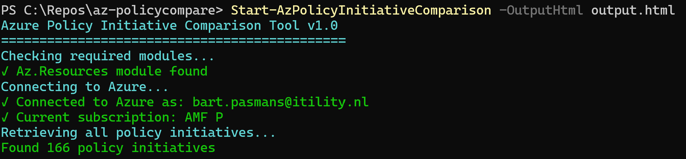
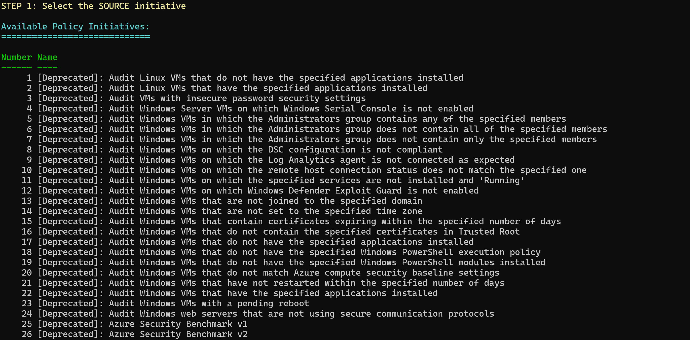
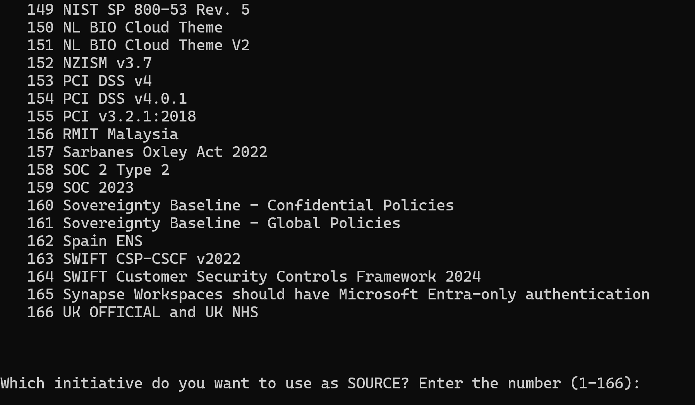
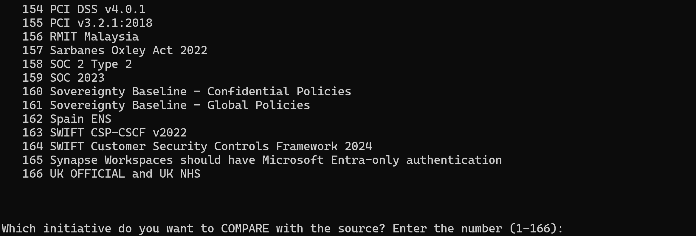
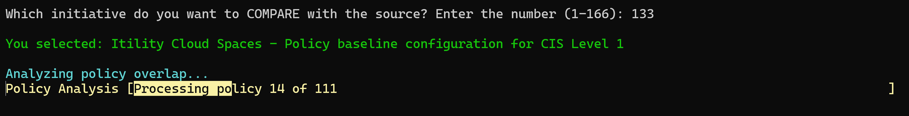
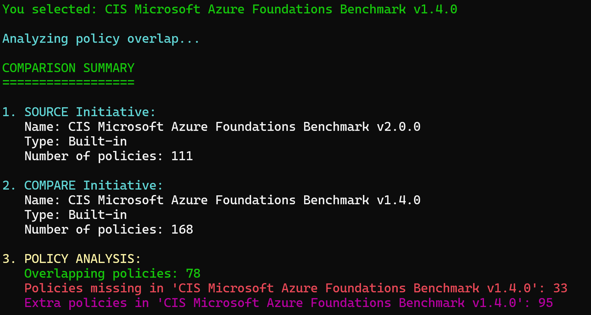
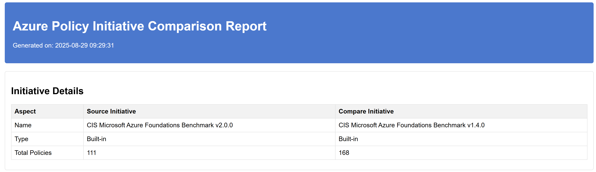
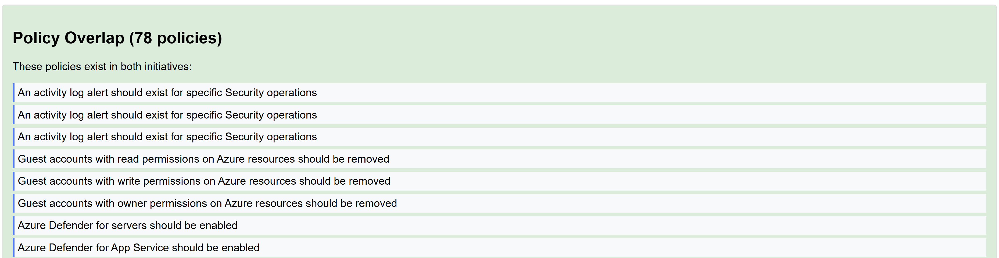
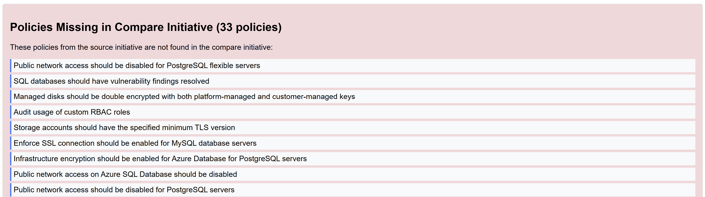
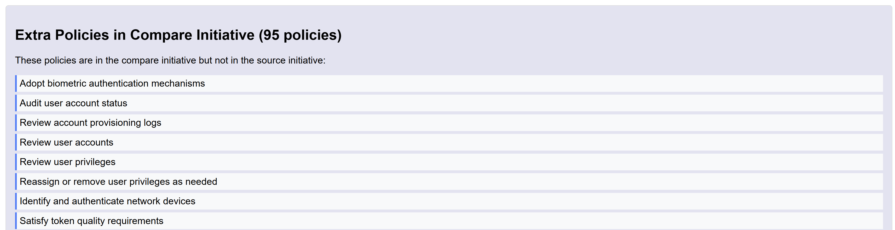

# AzPolicyCompare

A PowerShell module for comparing Azure Policy Initiatives to identify overlapping policies, missing policies, and provide detailed compliance mapping analysis.

## Author

**Bart Pasmans**
Company: bartpasmans.tech

## Features

- 🔍 **Compare Policy Initiatives**: Analyze differences between any two Azure Policy Initiatives
- 📊 **Detailed Analysis**: Identify overlapping policies, missing policies, and extra policies
- 🏢 **Enterprise Ready**: Support for both built-in and custom policy initiatives
- 📋 **Interactive Mode**: User-friendly interface for selecting initiatives
- 📝 **HTML Reports**: Export detailed comparison reports
- ⚡ **Fast Processing**: Optimized for large policy sets
- 🔒 **Secure**: Uses existing Azure authentication

## Installation

### From PowerShell Gallery

```powershell
Install-Module -Name AzPolicyCompare -Scope CurrentUser
```

### Manual Installation

1. Download the module files
2. Place them in your PowerShell module path
3. Import the module:

```powershell
Import-Module AzPolicyCompare
```

## Prerequisites

- **PowerShell 7.0** or later
- Az.Resources module
- Azure subscription access with appropriate permissions

```powershell
Install-Module -Name Az.Resources
```

## Quick Start

### Interactive Mode

```powershell
# Launch interactive comparison tool
Start-AzPolicyInitiativeComparison
```

### With HTML Export

```powershell
# Launch with HTML report export
Start-AzPolicyInitiativeComparison -OutputHtml "comparison-report.html"
```

## Visual Walkthrough

This section shows the step-by-step process of running the Azure Policy Initiative Comparison tool.

### Step 1: Starting the Tool


When you run `Start-AzPolicyInitiativeComparison`, the tool begins by:
- Checking for required PowerShell modules (Az.Resources)
- Connecting to your Azure account
- Displaying the tool header and version information

### Step 2: Loading Policy Initiatives


The tool automatically:
- Retrieves all policy initiatives from your Azure subscription
- Counts and displays the total number of initiatives found
- Sorts initiatives alphabetically by display name
- Prepares the numbered list for selection

### Step 3: Selecting Source Initiative


In this step:
- All available policy initiatives are displayed in a formatted table
- Each initiative shows: Number, Name, Type (Built-in/Custom), Policy Count, and Original ID
- You select the SOURCE initiative by entering its number
- The tool confirms your selection

### Step 4: Selecting Compare Initiative


Next, you:
- Choose the initiative to COMPARE against your source
- The same numbered list is displayed again
- Select a different initiative number for comparison
- The tool confirms your second selection

### Step 5: Processing and Analysis


The tool then:
- Retrieves all policies from both selected initiatives
- Shows progress indicators during policy retrieval
- Analyzes policy overlaps and differences
- Processes each policy definition to extract names and categories

### Step 6: Comparison Summary


Finally, the results are displayed:
- **Source Initiative**: Name, type, and total policy count
- **Compare Initiative**: Name, type, and total policy count  
- **Policy Analysis**: Number of overlapping, missing, and extra policies
- **Detailed Lists**: Complete enumeration of missing and extra policies

### Step 7: HTML Report Overview (Page 1)


If you specified an HTML output file, a professional report is generated containing:
- Report header with generation timestamp
- Initiative comparison table with key metrics
- Clean, professional styling for easy reading

### Step 8: HTML Report - Policy Overlap Section


The HTML report includes:
- **Policy Overlap Section**: Lists all policies that exist in both initiatives
- Color-coded sections (green for overlaps)
- Each policy displayed as an individual item
- Easy-to-scan format for quick analysis

### Step 9: HTML Report - Missing Policies Section


The report continues with:
- **Missing Policies Section**: Shows policies from source that aren't in compare initiative
- Color-coded in red to highlight gaps
- Detailed policy names for compliance mapping
- Helps identify what needs to be added to target initiative

### Step 10: HTML Report - Extra Policies Section


The final section shows:
- **Extra Policies**: Policies in compare initiative but not in source
- Color-coded in blue/purple to distinguish from missing policies
- Useful for understanding additional coverage in target initiative
- Complete, searchable format for detailed analysis

## Functions

### Start-AzPolicyInitiativeComparison

The main function that compares two Azure Policy Initiatives and identifies differences.

**Parameters:**
- `OutputHtml` - Optional path to export the comparison results as HTML

**Examples:**

```powershell
# Interactive mode - prompts for initiative selection
Start-AzPolicyInitiativeComparison

# Interactive mode with HTML export
Start-AzPolicyInitiativeComparison -OutputHtml "comparison-report.html"
```

## Use Cases

### Compliance Mapping
Compare different compliance frameworks to understand policy overlaps:

```powershell
# Run the tool and select CIS Benchmark vs NIST framework when prompted
Start-AzPolicyInitiativeComparison -OutputHtml "compliance-mapping.html"
```

### Migration Planning
Assess what policies are missing when migrating between initiatives:

```powershell
# Run tool to compare current baseline with target baseline
Start-AzPolicyInitiativeComparison -OutputHtml "migration-plan.html"
```

### Custom Initiative Development
Understand gaps in your custom policy initiatives:

```powershell
# Compare Azure Security Benchmark with your custom initiative
Start-AzPolicyInitiativeComparison -OutputHtml "gap-analysis.html"
```

## Output

The tool provides detailed console output showing:

- **Initiative Details**: Names, types, and policy counts
- **Policy Analysis**: 
  - Number of overlapping policies
  - Policies missing in the target initiative
  - Extra policies in the target initiative
- **Detailed Lists**: Complete lists of missing and extra policies

## HTML Report Features

Generated reports include:
- 📊 **Executive Summary** - High-level comparison metrics
- 📋 **Policy Lists** - Detailed policy breakdowns with categories
- 🎨 **Visual Styling** - Professional, easy-to-read format
- 📅 **Timestamps** - Generation date and time
- 🔍 **Searchable Content** - Find specific policies quickly

## Authentication

The module uses your existing Azure PowerShell authentication. Ensure you're logged in:

```powershell
Connect-AzAccount
Set-AzContext -SubscriptionId "your-subscription-id"
```

## Troubleshooting

### Common Issues

**"Module not found"**
```powershell
# Verify installation
Get-Module -ListAvailable AzPolicyCompare
```

**"Az.Resources not found"**
```powershell
# Install required dependency
Install-Module -Name Az.Resources
```

**"Access denied"**
- Ensure you have Reader access to Azure Policy
- Verify subscription context: `Get-AzContext`

**"PowerShell version"**
- Ensure you're using PowerShell 7.0 or later
- Check version: `$PSVersionTable.PSVersion`

### Verbose Output

The tool automatically provides progress indicators and detailed output during execution.

## Sample Workflow

1. **Install the module**:
   ```powershell
   Install-Module -Name AzPolicyCompare
   ```

2. **Connect to Azure**:
   ```powershell
   Connect-AzAccount
   ```

3. **Run the comparison**:
   ```powershell
   Start-AzPolicyInitiativeComparison -OutputHtml "my-report.html"
   ```

4. **Select initiatives**: The tool will list all available initiatives and prompt you to select source and compare initiatives

5. **Review results**: Check console output and generated HTML report

## Contributing

Contributions are welcome! Please feel free to submit issues, feature requests, or pull requests.

## License

This project is licensed under the MIT License - see the LICENSE file for details.

## Support

For support and questions:
- Create an issue on the project repository
- Contact: Bart Pasmans (bartpasmans.tech)

## Version History

### 1.0.0
- Initial release
- Core comparison functionality
- Interactive initiative selection
- HTML report generation
- Support for both built-in and custom policy initiatives
- PowerShell 7.0 compatibility